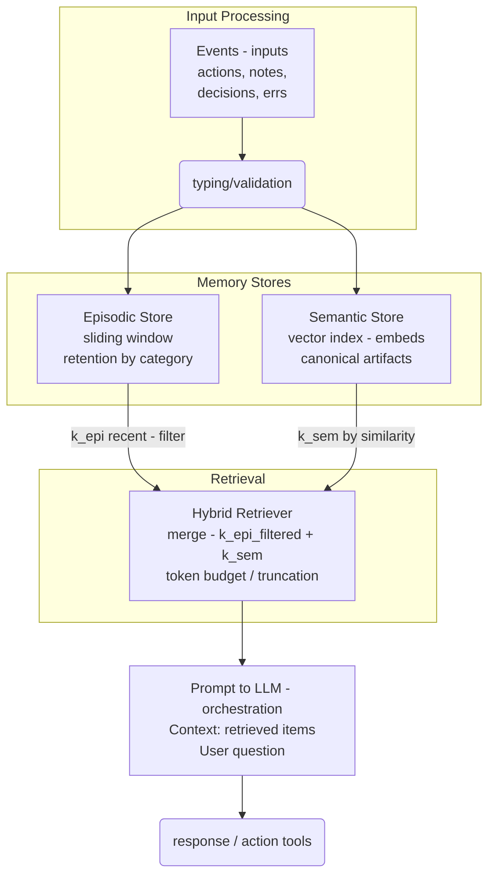

# Example code for the talk "Hybrid memory in agents — from myth to a useful minimum viable"

Objective
- Show a minimal hybrid memory pipeline (episodic + semantic) with two tools and a simple retriever.

## Design notes

- Type events from day 0: 
  - decisions, 
  - facts, 
  - errors, 
  - metadata, 
  - procedure,
  - etc.
- Small "k" values and filters before concatenation. Explicit token budget.
- Index only canonical artifacts in the semantic store (avoid chat noise).
- Minimal traces: inputs, retrieved (ids), output, latency.
- Event ingestion → episodic store
- Semantic indexing → vector store
- Retrieval policy (k episodes + k semantics with filters)
- Token budget and limits

## Metrics and observability
- Useful recall (R@k), "no-memory response" rate
- P95 latency, context size
- Minimal traces (inputs, retrieved, outputs)

## Design checklist
- Define event schema and categories
- Retention and expiration policies
- Retrieval thresholds and filters
- Testing with edge cases

## Minimal pipeline

```	 
           +--------------------+
           |  Events (inputs)   |
           |  actions, notes,   |
           |  decisions, errs   |
           +----------+---------+
                      |
              (typing/validation)
                      |
                      v
+--------------------------+        +---------------------------+
|       Episodic Store     |        |      Semantic Store       |
|  sliding window          |        |  vector index (embeds)    |
|  retention by category   |        |  canonical artifacts      |
+-------------+------------+        +--------------+------------+
              |                                  |
              | k_epi recent (filter)            | k_sem by similarity
              v                                  v
            +----------------------------------------+
            |           Hybrid Retriever             |
            |  merge(k_epi_filtered + k_sem)         |
            |  token budget / truncation             |
            +------------------+---------------------+
                               |
                               v
            +----------------------------------------+
            |        Prompt to LLM (orchestration)   |
            |  Context: retrieved items              |
            |  User question                         |
            +------------------+---------------------+
                               |
                    response / action (tools)
```



# Resources

This repo is inspired in the article [Memory in Agents: Episodic vs. Semantic, and the Hybrid That Works](https://principia-agentica.io/blog/2025/09/19/memory-in-agents-episodic-vs-semantic-and-the-hybrid-that-works/)
