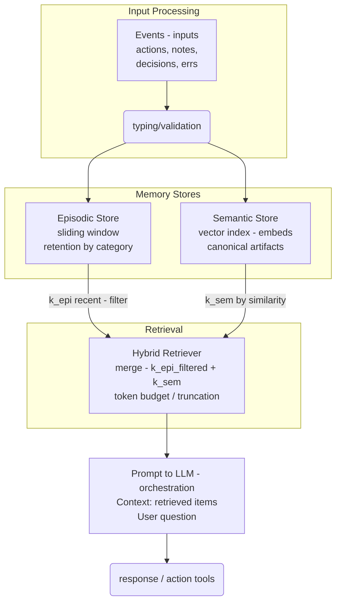

# Example code for the talk "Hybrid memory in agents — from myth to a useful minimum viable"

This repository contains a small, fully offline demo that illustrates hybrid memory for agents (episodic + semantic), a simple hybrid retriever, two toy tools, a minimal orchestration Agent, and tiny JSONL traces.

## Quickstart

- pip install -e .
- just demo  # run the CLI demo under examples/
- just notebook  # open Jupyter Lab in examples/ with a narrative notebook
- just test  # run the test suite

## Architecture at a glance

user → Agent → [Episodic + Semantic] via HybridRetriever → Answer (+ Tracer)

```
User question
   ↓
Agent (orchestration)
   ↓                         ↘
Episodic Store (recent N)     Hybrid Retriever → merged context → Answer
   ↑                         ↗                                 ↘
Semantic Store (policy k)                                   Tracer (JSONL)
```

- See the article and the plan for the full story:
  - context/091925-memory-in-agents.md
  - context/plan.md

## Configuration (env overrides)
The demo has sensible defaults but you can tweak behavior via environment variables (no code changes):

```bash
# Retrieval sizes
export HM_K_EPI=4            # episodic window size (default 4)
export HM_K_SEM=3            # semantic top-k (default 3)

# Token budget for merged context
export HM_TOKEN_BUDGET=1600  # default 1600

# Episodic TTL (days) used when an event type has no specific TTL
export HM_EPISODIC_TTL_DAYS=30

# Optional filters (JSON) applied by default
export HM_EPI_FILTERS_JSON='{"session": "sess_1"}'
export HM_SEM_FILTERS_JSON='{"tags": ["policy"], "pii": false}'

# Lightweight semantic-first reranker
export HM_RERANKER_ENABLED=true
```

## Design notes

- Type events from day 0: 
  - decisions, 
  - facts, 
  - errors, 
  - metadata, 
  - procedure,
  - etc.
- Small "k" values and filters before concatenation. Explicit token budget.
- Index only canonical artifacts in the semantic store (avoid chat noise).
- Minimal traces: inputs, retrieved (ids), output, latency.
- Event ingestion → episodic store
- Semantic indexing → vector store
- Retrieval policy (k episodes + k semantics with filters)
- Token budget and limits

## Metrics and observability
- Useful recall (R@k), "no-memory response" rate
- P95 latency, context size
- Minimal traces (inputs, retrieved, outputs)

## Design checklist
- Define event schema and categories
- Retention and expiration policies
- Retrieval thresholds and filters
- Testing with edge cases

## Minimal pipeline

```	 
           +--------------------+
           |  Events (inputs)   |
           |  actions, notes,   |
           |  decisions, errs   |
           +----------+---------+
                      |
              (typing/validation)
                      |
                      v
+--------------------------+        +---------------------------+
|       Episodic Store     |        |      Semantic Store       |
|  sliding window          |        |  vector index (embeds)    |
|  retention by category   |        |  canonical artifacts      |
+-------------+------------+        +--------------+------------+
              |                                  |
              | k_epi recent (filter)            | k_sem by similarity
              v                                  v
            +----------------------------------------+
            |           Hybrid Retriever             |
            |  merge(k_epi_filtered + k_sem)         |
            |  token budget / truncation             |
            +------------------+---------------------+
                               |
                               v
            +----------------------------------------+
            |        Prompt to LLM (orchestration)   |
            |  Context: retrieved items              |
            |  User question                         |
            +------------------+---------------------+
                               |
                    response / action (tools)
```



# Resources

This repo is inspired in the article [Memory in Agents: Episodic vs. Semantic, and the Hybrid That Works](https://principia-agentica.io/blog/2025/09/19/memory-in-agents-episodic-vs-semantic-and-the-hybrid-that-works/)
